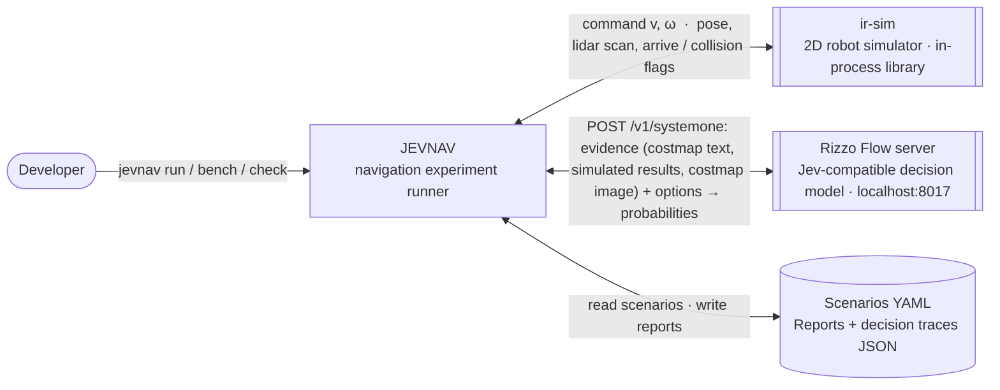
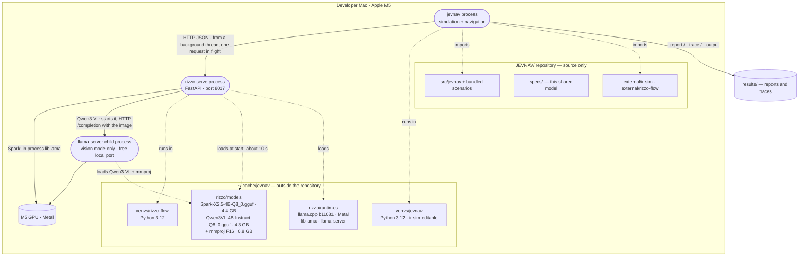
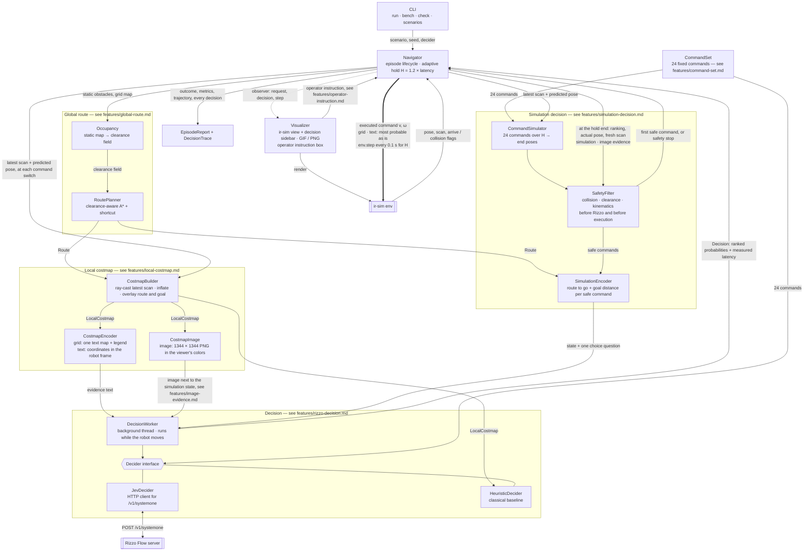
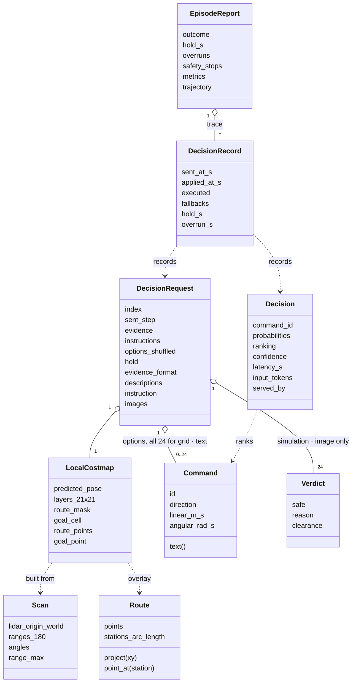

# JEVNAV — Architecture

## Goal

Drive a differential-drive robot in ir-sim to its goal, avoiding collisions and following an
optimized route. Every motion decision is made by Rizzo Flow, a local Jev-style "System One"
model. Its input is the latest local costmap built from the lidar. Its output is a probability
for each of the same 24 motion commands.

With `rizzo serve --vision` (Rizzo Flow branch `vlm-costmap-image`), Rizzo's base model is
the vision-language model Qwen3-VL-4B-Instruct, and `--evidence image` sends the costmap as a
picture next to the simulated options (features/image-evidence.md).

## 1 · System Context

## 2 · Containers and deployment

## 3 · Components inside JEVNAV

## 4 · Key data

## Notes

- **Robot:** differential drive only (command = linear v, angular ω). Linear speed is fixed
  at 0.25 m/s; rotation in place is 45°/s (π/4 rad/s). The bundled scenarios use a 0.2 m
  radius and a 360° lidar with 180 beams and 5 m range.
- **Rizzo sees one snapshot, never a history.** With `grid` evidence it reads the latest
  costmap only, with the route and the goal drawn into it (see features/local-costmap.md);
  `text` describes the same costmap as coordinates in the robot frame (see
  features/text-evidence.md). `simulation` replaces the costmap with each safe command's
  simulated results, and `image` adds the costmap to them as a picture. Moving obstacles look
  static to the model in every mode.
- **No safety net with grid and text evidence.** The most probable command is executed as is,
  and a collision ends the episode. This is an explicit experiment choice. Simulation and image
  evidence revalidate the ranking from the actual pose at the hold end and fall back to the next
  safe command, or a safety stop (features/simulation-decision.md).
- **Known risk:** Rizzo Flow's README reports that the 4B model plays Snake well with
  per-move sensor text, but dies within 13–26 moves with an ASCII grid only. This design tests
  grid-only input on navigation. The HeuristicDecider runs on the same costmap and the
  same 24 commands, so `bench` measures how much the model gains or loses against it.
- **Decisions arrive while the robot moves.** Each command is held for H = 1.2 × Rizzo's
  latency, adapted at every decision (1.6–1.9 s on the M5, where a request takes 1.3–1.6 s
  and slows under sustained load). The next decision is
  computed during the hold from a costmap drawn around the predicted pose, and applied when
  the hold ends. Each request's measured latency is replayed in simulated time, so the robot
  behaves as in real time whatever the simulator's own speed (see features/rizzo-decision.md).
  For slow models, `--sim-latency S` counts every answer as S seconds instead and pauses the
  simulation while the model thinks (fake timing).
- **Snake logic** (`--evidence simulation`, and `image` on top of it). As in Rizzo's Snake
  demo, the simulator computes what every command would do, and Rizzo only chooses. Unsafe
  commands (collision, clearance under 0.05 m, velocity limits) are removed first; each safe
  one is offered with the route still to go, the straight-line goal distance and the closest
  obstacle after it (see features/simulation-decision.md).
- **Jev wire format.** JEVNAV only uses `/v1/systemone`, so the hosted Jev works by changing
  `--jev-url`. 24 options fit Rizzo's limit of 26 answer letters (A–X are used).
  `--evidence image` adds an `images` field that only the local Rizzo's vision mode accepts.
- **Vision mode** (Rizzo Flow branch `vlm-costmap-image`). `rizzo serve --vision` runs Qwen3-VL-4B-Instruct
  (`--model` + `--mmproj` for other files) through the runtime's own llama-server, which
  handles image tokens; Rizzo keeps its prompt, answer letters and softmax
  (features/image-evidence.md).
- **Visualizer** (`jevnav run --render`): ir-sim's own view on the left (robot, lidar beams,
  obstacles, trajectory) plus the global route, the command being held and the pose where the
  next decision starts. The sidebar shows the status (including "paused, waiting for the
  model" while an answer is late), a 24-direction probability compass, the exact costmap of the
  latest decision with the held command's path (titled for the evidence mode), and the decision
  log. `--speed` sets the real-time playback factor; `--save-gif` and `--save-frame` work
  headless.
  An instruction box and preset buttons at the top left, above the simulation, add an operator
  instruction to every new request's question (features/operator-instruction.md).
  The window comes to the front once, when the run starts. Every later frame leaves it where
  it is (matplotlib's `figure.raise_window` is turned off; otherwise each `plt.pause` raises it
  on macOS), and after the run it stays open until closed without being raised again
  (`plt.show()` would activate the app), so it can sit behind other windows and never takes
  the focus back.
