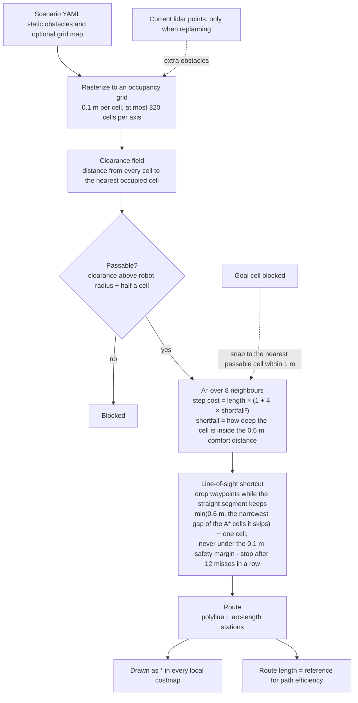

# Global route

## Goal

Before driving, find a route to the goal that is short and keeps a comfortable distance from
the static obstacles. The route is the path-optimization reference and is drawn as `*` into
every local costmap.

## Flow

## Notes

- "Optimized" means the shortest route that stays passable. The proximity cost trades a little
  length for distance from obstacles, and the shortcut removes grid zig-zags.
- The static map is known in advance (from the scenario). Moving obstacles are never part of
  the route; they only show up in the lidar costmaps.
- Path efficiency = initial route length / distance actually traveled (arrived episodes only).
- This is a custom planner rather than ir-sim's `AStarPlanner`, which plans for a point-sized
  robot and scans its open set linearly (slow on large maps).
