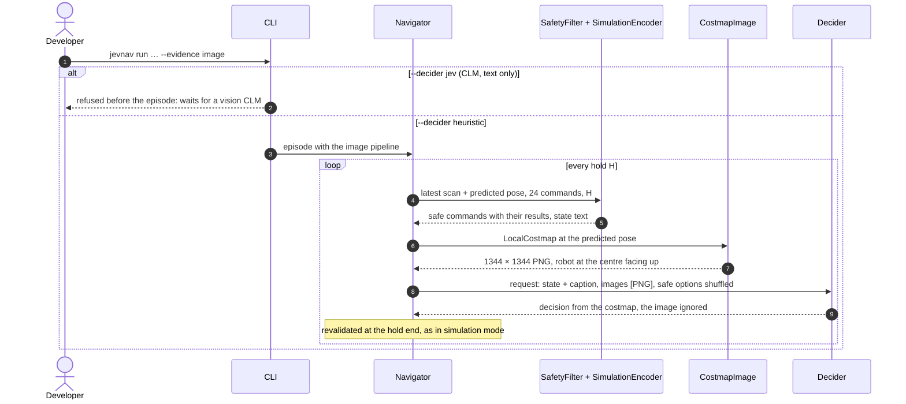

# Image evidence (experiment 3, `--evidence image`) · dormant

## Goal

Give the model the local costmap as an image next to the simulated options. Everything else
is the Snake logic of features/simulation-decision.md: every command is simulated, colliding
ones are removed, and each safe option carries its route still to go, distance off the
route, goal distance and clearance. The model would see where the obstacles and the route
are, and read what each command would achieve.

**Dormant since 2026-10-05.** CLM v0.1 reads text only: its encoder is Qwen3-8B, and
`clm-serve` ignores an `images` field without an error. CLM's README lists "vision and
multimodal support" on its roadmap. JEVNAV keeps building the image and refuses to send it
to a Jev-compatible server until a vision CLM exists, so no run silently loses its picture.
The heuristic decider still runs the whole pipeline, which keeps it tested.

## Interaction



## The image

| Property | Value |
| --- | --- |
| Content | The LocalCostmap of features/local-costmap.md, the same cells the viewer shows |
| Size | 21 × 21 cells at 64 px per cell = 1344 × 1344 px, PNG, about 10 KB |
| Why 64 px | Sized for Qwen3-VL, the vision model this mode was built with: one visual token per 32 × 32 px (16 px patches merged 2 × 2), and llama.cpp's warning that Qwen-VL needs "at minimum 1024 image tokens to function correctly on grounding tasks". 64 px makes every cell exactly 2 × 2 tokens (1764 in all), so nothing is resized and no cell edge falls inside a token. A vision CLM may want another size |
| Orientation | Robot at the centre cell facing the top edge; the image's left is the robot's left |
| Colors | The viewer's costmap palette (`palette.py`, shared with the sidebar): obstacle black, too close dark gray, near obstacle light gray, free white, unknown pale gray with a dot, route blue, goal green |
| Robot | Orange triangle with a white outline, pointing up, over the centre cell's own color |
| Not drawn | Command paths and labels: the options stay text |

`--image-cell` must be a multiple of 32 giving 1024–4096 image tokens: 64 (default) or 96
(2016 px, 3969 tokens). Any other value is refused before the episode starts.

## Evidence (the `state` text next to the image)

The simulation state of features/simulation-decision.md, followed by one paragraph that
explains the image:

```
The image is the local costmap from the lidar, centred on the robot at the pose where the
next command starts, facing the top edge. It spans 4.2 m by 4.2 m, 0.2 m per cell; the
image's left is the robot's left. Black: obstacle. Dark gray: too close, the robot would
collide. Light gray: near an obstacle. White: free. Pale gray with a dot: unknown. Blue: the
planned route to the goal. Green: the goal. Orange triangle: the robot.
```

The question and its options are exactly the simulation mode's.

## Wire format

One additive field on the Jev request; requests without `images` are unchanged.

```json
{
  "model": "…",
  "state": "Differential-drive robot of radius 0.2 m … The image is the local costmap …",
  "images": ["<base64 PNG>"],
  "questions": {"command": {"type": "choice", "instructions": "Which command …", "criteria": {"FL30": "…"}}}
}
```

## JEVNAV parts

- `EvidenceFormat.IMAGE`: the simulation pipeline (safety filter, simulated options, final
  validation) plus the image. The HeuristicDecider ignores the image, as it ignores text.
- `costmap_image.py`: renders a LocalCostmap to PNG with the viewer's palette; `--image-cell`
  sets the pixels per cell.
- `DecisionRequest.images`; `JevDecider` sends `images` when present.
- CLI: `--decider jev` with `--evidence image` stops before the episode with "CLM v0.1 reads
  text only and drops the image, so this mode waits for a vision CLM". It applies to `run`
  and `bench`.
- Trace: each decision stores `image_png` (base64), so a run can be inspected exactly as the
  model would see it.
- Viewer: the costmap panel is titled "Costmap image the model saw".

## Command line

```bash
uv run jevnav run slalom --decider heuristic --render --evidence image
uv run jevnav run slalom --decider heuristic --evidence image --trace runs/image.json
```

## Notes

- **To wake it up:** a CLM release that embeds images, served behind `/v1/systemone` with an
  `images` field (or another field JEVNAV then adapts to). Remove the CLI refusal, check the
  image size against that model's vision encoder, and measure latency; `--sim-latency`
  absorbs a slow model (features/model-decision.md).
- The hosted Jev does not accept `images` either.

## Decisions

- 2026-09-25: the image is sized the way the vision model expects (64 px per cell, 1764
  tokens), latency aside; slow answers are handled by fake timing, not by a smaller image.
- 2026-10-05: with the switch to CLM, the mode is kept but dormant rather than removed, and
  refused for `--decider jev` rather than sent to a server that drops the image.

## Open Questions

- Which image size and wire field a vision CLM will expect.
