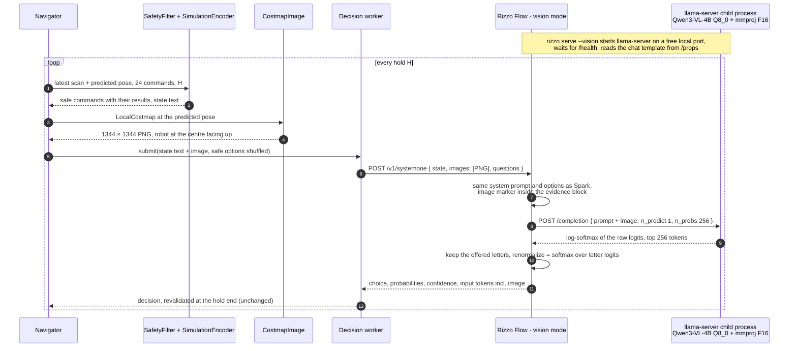

# Image evidence with a vision model (experiment 3, `--evidence image`)

## Goal

Swap Rizzo Flow's base model for the vision-language model Qwen3-VL-4B-Instruct and give it
the local costmap as an image instead of text. Everything else is the Snake logic of
features/simulation-decision.md: every command is simulated, colliding ones are removed, and
each safe option carries its route still to go, distance off the route, goal distance and
clearance. The model sees
where the obstacles and the route are, and reads what each command would achieve. Spark-X2.5
and the `grid`, `text` and `simulation` modes stay available for comparison.

JEVNAV `main` (merged from branch `vlm-costmap-image` on 2026-09-28); Rizzo Flow branch
`vlm-costmap-image` in `external/rizzo-flow`.

## Interaction



## The image

| Property | Value |
| --- | --- |
| Content | The LocalCostmap of features/local-costmap.md, the same cells the viewer shows |
| Size | 21 × 21 cells at 64 px per cell = 1344 × 1344 px, PNG: 1764 image tokens |
| Why 64 px | What the model expects, as llama.cpp b11081 sets it for Qwen-VL: one visual token per 32 × 32 px (16 px patches merged 2 × 2), 8–4096 tokens per image, and "at minimum 1024 image tokens to function correctly on grounding tasks". 64 px makes every cell exactly 2 × 2 tokens, so llama.cpp never resizes (bicubic) and no cell edge falls inside a token |
| Orientation | Robot at the centre cell facing the top edge; the image's left is the robot's left |
| Colors | The viewer's costmap palette (`palette.py`, shared with the sidebar): obstacle black, too close dark gray, near obstacle light gray, free white, unknown pale gray with a dot, route blue, goal green |
| Robot | Orange triangle with a white outline, pointing up, over the centre cell's own color |
| Not drawn | Command paths and labels: the options stay text |

`--image-cell` must be a multiple of 32 giving 1024–4096 image tokens: 64 (default) or 96
(2016 px, 3969 tokens). Any other value is refused before the episode starts.

## Evidence (the `state` text next to the image)

The simulation state of features/simulation-decision.md, followed by one paragraph that
explains the image:

```
The image is the local costmap from the lidar, centred on the robot at the pose where the
next command starts, facing the top edge. It spans 4.2 m by 4.2 m, 0.2 m per cell; the
image's left is the robot's left. Black: obstacle. Dark gray: too close, the robot would
collide. Light gray: near an obstacle. White: free. Pale gray with a dot: unknown. Blue: the
planned route to the goal. Green: the goal. Orange triangle: the robot.
```

The question and its options are exactly the simulation mode's.

## Wire format

JEVNAV → Rizzo, one additive field. Requests without `images` behave as before.

```json
{
  "model": "rizzo-latest",
  "state": "Differential-drive robot of radius 0.2 m … The image is the local costmap …",
  "images": ["<base64 PNG>"],
  "questions": {"command": {"type": "choice", "instructions": "Which command …", "criteria": {"FL30": "…"}}}
}
```

Rizzo places each image as llama.cpp's media marker at the start of the evidence block:

```
<evidence>
<__media__>
Differential-drive robot of radius 0.2 m …
</evidence>

Question: Which command should the robot hold for the next 3.1 s?
Options:
A. …
```

## Rizzo Flow vision mode (external/rizzo-flow, same branch)

| Part | Change |
| --- | --- |
| `rizzo serve --vision` | Selects the vision backend with the pinned pair below; `--model` + `--mmproj` for other files. Without them, Spark in-process as before |
| Vision backend (`backend_vision.py`) | Starts the runtime's own `llama-server --model … --mmproj … --ctx-size (ctx + 2048) --n-gpu-layers 999 --parallel 1 --no-webui` on a free local port, logs to `llama-server.log`; stops it with the server |
| Request | `images`: up to 4 base64 PNG or JPEG, no `data:` prefix; a text-only model answers 422 |
| Prompt | Same system prompt, question and closing line; the GGUF chat template from `/props`, rendered by Rizzo as for Spark. Rizzo's `<__media__>` markers are swapped for llama-server's random marker (`/props` `media_marker`) when sent, after checking there is exactly one per image |
| Answer letters | Each offered letter must be one token (Rizzo's existing check, through `/tokenize`) |
| Probabilities | `/completion` with `n_predict: 1`, `n_probs: 256`, no prompt cache. Renormalized over the offered letters, which equals Rizzo's softmax over the letter logits. A letter outside the top 256 gets the lowest reported value, counted in `x_rizzo.timing.letters_below_top_n` |
| Usage | `input_tokens` = llama-server's `tokens_evaluated`, image tokens included |
| Served name | `rizzo-qwen3-vl-4b-instruct-q8_0` |
| Download | `rizzo download --vision` (resume, sha256, as for Spark) |

Pinned files, `Qwen/Qwen3-VL-4B-Instruct-GGUF@1cd86afb9a95c410a6038ab3b40d8b578c892266`,
into `~/.cache/jevnav/rizzo/models/Qwen3-VL-4B-Instruct-GGUF/`:

| File | Size | sha256 |
| --- | ---: | --- |
| `Qwen3VL-4B-Instruct-Q8_0.gguf` | 4.28 GB | `054721f4…a727863eb1` |
| `mmproj-Qwen3VL-4B-Instruct-F16.gguf` | 0.84 GB | `256f3a43…a9985331` |

## JEVNAV changes

- `EvidenceFormat.IMAGE`: the simulation pipeline (safety filter, simulated options, final
  validation) plus the image. The HeuristicDecider ignores the image, as it ignores text.
- `costmap_image.py`: renders a LocalCostmap to PNG with the viewer's palette; `--image-cell`
  sets the pixels per cell.
- `DecisionRequest.images`; `JevDecider` sends `images` when present.
- Trace: each decision stores `image_png` (base64, about 10 KB at 64 px with flat colors), so
  a run can be inspected exactly as the model saw it.
- Viewer: the costmap panel is titled "Costmap image the model saw".

## Command line

```bash
cd ~/.cache/jevnav/rizzo && ~/.cache/jevnav/venvs/rizzo-flow/bin/rizzo download --vision --only weights   # once
cd ~/.cache/jevnav/rizzo && ~/.cache/jevnav/venvs/rizzo-flow/bin/rizzo serve --vision
uv run jevnav run slalom --render --evidence image --sim-latency 1
uv run jevnav run slalom --evidence image --sim-latency 1 --trace runs/image.json
```

## Check at 64 px (2026-09-25, M5, 2 slalom requests)

| Image | Input tokens | Latency | PNG |
| --- | ---: | ---: | ---: |
| 64 px per cell, 1344 × 1344 | 3,781–3,791, of which 1764 image | 10.2–10.6 s | 9–10 KB |

- The same requests had 441 image tokens at 32 px: the difference is exactly 1764 − 441, so
  llama-server reads the image as 42 × 42 tokens, unresized.
- Prompt evaluation 365–375 tokens/s; every offered letter inside the top 256.
- With `--sim-latency 1` each of these answers counts as 1 s of simulated time; an episode of
  about 50 decisions takes about 9 minutes of wall-clock time.

## First smoke test (2026-09-25, M5, 6 requests from slalom costmaps, before 64 px)

| Image | Input tokens | Latency | Of which Rizzo |
| --- | ---: | ---: | ---: |
| 32 px per cell (441 image tokens) | 2,297–2,468 | 6.4–7.0 s, 8.8 s a few minutes later | 0.03–0.04 s |
| 16 px per cell (121 image tokens) | 1,977 | 6.3 s | |

- Almost all the time is llama-server's prompt evaluation, 280–390 tokens/s, slowing under
  sustained load like Spark. Spark took 2.2–2.7 s for 1,777 tokens in `runs/simulation-eu.json`.
- Every offered letter was inside the top 256; a repeated request gave the same answer.
- Answers were forward-curving commands with some spread (FR75 0.63 / FR45 0.36, FL45 0.66),
  and FR45 0.999 where the heuristic chose F. No accuracy measured yet.
- With H = 1.2 × latency, holds would be about 8–10 s: 2.0–2.5 m of travel per command, as
  long as the costmap's half-width (2.1 m). Hence fake timing: `--sim-latency 1` counts every
  answer as 1 s and pauses the simulation meanwhile (features/rizzo-decision.md).

## Notes

- **Latency** is measured above. Fake timing (`--sim-latency`) absorbs it; the adaptive hold
  alone would give holds longer than the costmap reaches.
- **Memory:** 4.3 GB of weights, 0.8 GB of projector, plus the KV cache. Still one model
  process at a time.
- **Not supported in vision mode:** sharing one evidence prefix across several questions.
  JEVNAV asks one question per request, so each question gets its own forward pass.
- The hosted Jev does not accept `images`; `--evidence image` needs the local Rizzo.
- **Probabilities checked in the source** (2026-09-25): at b11081, `n_probs` without
  `post_sampling_probs` comes from `get_token_probabilities`, a softmax of the raw logits over
  the whole vocabulary before any sampler (`tools/server/server-common.cpp`).
- A PNG of the slalom costmap is 9–10 KB at 64 px (about 3 KB at 32 px). Each trace record
  stores it as `image_png`.
- **Shutdown.** uvicorn re-raises SIGTERM after its graceful shutdown, which ended Rizzo before
  it could stop its child. `rizzo serve` now exits through `SystemExit` on SIGTERM, so
  llama-server stops with it (checked). Only a SIGKILL of Rizzo leaves the child running and
  holding the GPU memory.
- llama.cpp warns at load time that Qwen-VL "requires at minimum 1024 image tokens to function
  correctly on grounding tasks" (`--image-min-tokens 1024`). The 64 px image uses 1764, above
  that minimum; the earlier 32 px image used 441.
- Full hashes: model `054721f478bc5fa6beffb7f38eae575d45298f88cbb8d2f83ef675a727863eb1`,
  projector `256f3a43bd4205ffef48d6b92715e1e70b5b0e9aef06522584967513a9985331`.

## Decisions (2026-09-25)

- The image is sized the way the model expects (64 px per cell, 1764 tokens), latency aside.
- Slow answers are handled by fake timing (`--sim-latency 1`), not by a smaller image.

## Open Questions

- none
