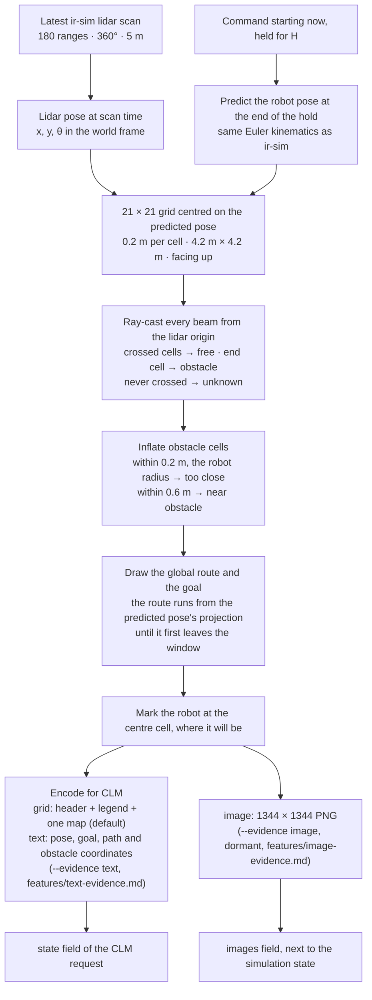

# Local costmap

## Goal

Each time a command starts, turn the latest lidar scan into one local costmap for the next
decision. The map is centred on the pose the robot will have when that decision starts, and
the global route and the goal are drawn into it. With `grid` and `text` evidence it is encoded
as the text CLM reads and is the only information the model gets. `image` evidence, dormant
until a vision CLM exists, renders it as a picture next to the simulated options
(features/image-evidence.md). `simulation` evidence does not send it; the viewer and the heuristic still read it.

## Flow



## Cell legend and draw order

| Char | Layer | Meaning | Draw priority |
| :---: | --- | --- | :---: |
| `R` | robot | robot centre, always the middle cell, facing row 1 | 1 |
| `#` | obstacle | a lidar beam ended here | 2 |
| `x` | too close | within the robot radius of `#`: robot centre here = collision | 3 |
| `G` | goal | goal cell, only when it is inside the window | 4 |
| `*` | route | global route from the A* planner | 5 |
| `+` | near obstacle | within 0.6 m of `#` | 6 |
| `.` | free | a beam passed through this cell | 7 |
| `?` | unknown | no beam reached this cell (occluded or out of range) | 8 |

The route and the goal never hide an obstacle or a too-close cell. Inflation marks only cells
a beam passed through; unknown cells stay `?`.

## Example — the map as CLM sees it

Generated by ray-casting the same way (a wall ahead-right, a box on the left, the route
bending left around the wall end). The shadows behind both obstacles are unknown.

```
.....*..?????????????
.....**..????????????
......*++????????????
......*++???????????+
......*+x##########x+
......*++xxxxxxxxxx++
......**+++++++++++++
...+...**++++++++++..
.+++++..**...........
.++x++...**..........
???#x++...R..........
???#x++..............
???#x++..............
?++x++...............
.+++++...............
...+.................
.....................
.....................
.....................
.....................
.....................
```

## Text encoding (the `state` field, `--evidence grid`)

```
Local costmap around a differential-drive robot.
The map has 21 rows and 21 columns, 0.2 m per cell. R is where the robot will be when the
chosen command starts, always the centre cell, facing the top row: row 1 is 2.0 m ahead,
column 1 is 2.0 m to the left.
Legend: # obstacle, x too close (collision), + near obstacle, . free, ? unknown,
* planned route to the goal, G goal.

<21 lines>
```

## Notes

- **Predicted pose.** The chosen command starts only when the current hold ends, after the
  robot has moved up to 0.25 m/s × H or rotated up to 45°/s × H (0.43 m or 77° at H = 1.7 s).
  The map is therefore drawn around the pose the robot will have then, predicted from the
  current command. For static obstacles
  the prediction is exact; the scan itself is H old when the command starts.
- **One map only** (decided 2026-09-24, for speed). Every map adds about 141 tokens to the
  state that is embedded at every decision (see features/model-decision.md).
- **No motion cue.** A single snapshot can't show which way a moving obstacle is heading, so
  movers look static to the model, and they are drawn where they were H ago.
- Window: 21 × 21 at 0.2 m (±2.1 m, about 8 s of travel at 0.25 m/s) is the starting
  point, to be tuned later. Tokens grow with the square of the window width (about 141
  tokens per map at this size).
- Costmaps use lidar only. The static map from the scenario is used only for the global route.
- **First scan** (fixed 2026-09-24). ir-sim fills a lidar's ranges only inside `step()`, so
  until then every beam reads "no return". The navigator now calls `robot.sensor_step()`
  before planning. Before this fix, the first request R0 of every episode, in every mode, saw
  an empty map.

## Open Questions

- none
