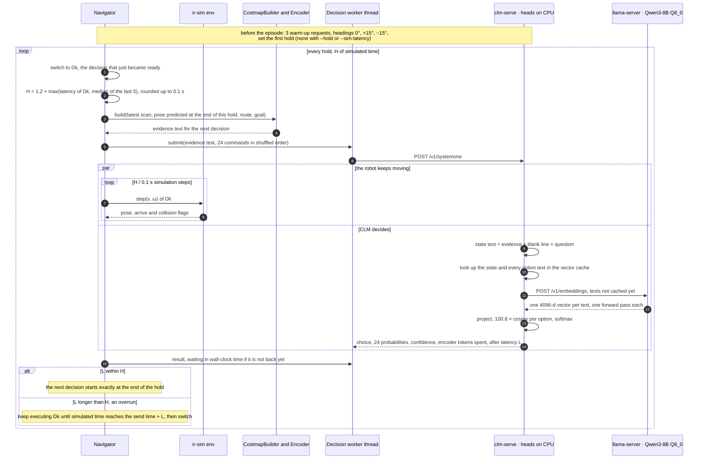
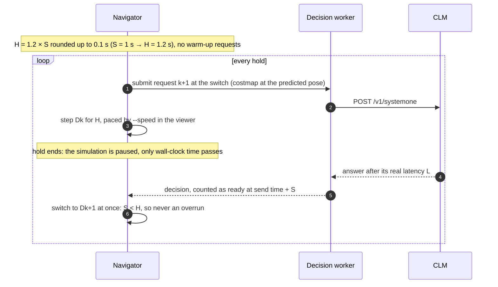

# Model decision (CLM)

## Goal

CLM-8B decides while the robot moves. Each command is held for a time H a little longer than
the model's latency: H = 1.2 × latency. The next decision is computed during that hold, so it
is ready when the hold ends. H follows the latency the model actually shows, so it stretches
when the Mac slows down. The robot changes direction only when a new decision has arrived.
With `grid` and `text` evidence there is no safety net; `simulation` and `image` revalidate
the choice at the hold end (features/simulation-decision.md).

CLM is a contrastive model, not a generator. A frozen Qwen3-8B encoder turns a text into one
vector (the last token's hidden state, L2-normalized). Two trained heads of about 20M
parameters each project it to 512 dimensions: the state head for the situation, the action
head for an option. An option's score is about 100.8 × the cosine between the two
projections, and the answer is the softmax over the offered options.

## Timeline (example: latency 1.1 s, so H = 1.4 s)

```
simulated time (s)  0.0      1.1                 2.5                 3.9
                     │        │                   │                   │
robot command        │ still  │ D0                │ D1                │ D2  …
                     │        │                   │                   │
CLM request          │ R0 ──► │ R1 ─────►         │ R2 ─────►         │ R3  …
                     │ C0     │ C1    ready       │ C2    ready       │ C3
                     │        │       2.2         │       3.6         │
```

- **Ck**: the costmap captured when request Rk is sent. It is drawn around the pose the robot
  will have when Dk starts (see features/local-costmap.md).
- **Rk → Dk**: CLM's answer arrives after its measured latency, and is applied at the first
  0.1 s step after the previous hold ends.
- At the start the robot stands still until D0 arrives.

## Interaction



## How latency maps to simulated time

- Every request's wall-clock latency L is measured, and its answer takes effect at
  send time + L in **simulated** time, rounded up to the next 0.1 s step. The robot therefore
  behaves exactly as if the simulator ran in real time.
- The simulator itself may run faster (headless) or slower (rendering) than the wall clock;
  that does not change the robot's behavior.
- **Wall-clock cost:** each hold takes about max(L, time to step H / 0.1 s times).

## Fake timing (`--sim-latency S`)

Real-time replay only works while the model answers in a couple of seconds. CLM with
`simulation` evidence takes 7–13 s on the M5 (below), which would mean holds farther than the
costmap reaches. With `--sim-latency S`, every answer counts as S seconds of simulated time,
whatever it took in wall-clock time, and the simulation stops at the command switch until it
arrives.



- The trace keeps the measured latency (`latency_s`); the report adds `sim_latency_s`.
- Safety stops still count 0 s. The heuristic in `bench` gets the same S.
- The viewer keeps refreshing during the pause and shows how long the model has been
  thinking; the robot does not move.

## Request sent to CLM (abridged, `--evidence grid`)

With `--evidence text`, `state` and `instructions` are the coordinate description of
features/text-evidence.md; the 24 criteria are unchanged.

```json
{
  "model": "clm-latest",
  "state": "Local costmap around a differential-drive robot. … * planned route to the goal, G goal.\n\n.....*..?????????????\n…",
  "questions": {
    "command": {
      "type": "choice",
      "instructions": "Choose the motion command the robot will hold for the next 1.4 s. Every move is at 0.25 m/s and rotations turn 45 degrees per second. Follow the planned route (*) toward the goal (G). Never drive into obstacle (#) or too-close (x) cells; avoid near-obstacle (+) and unknown (?) cells when you can.",
      "criteria": {
        "FL30": "Forward, curving left 15 degrees per second.",
        "L": "Full left: rotate in place to the left.",
        "…": "24 entries in total, shuffled at every decision"
      }
    }
  }
}
```

CLM embeds `state + "\n\n" + instructions` with the state head and each criteria text, as
written, with the action head. The keys never reach the model.

## Response shape (numbers from one real grid request)

```json
{
  "model": "clm-latest",
  "answers": {
    "command": {
      "type": "choice",
      "choice": "FL60",
      "confidence": 0.149,
      "probabilities": {"FL60": 0.185, "FL45": 0.17, "…": "24 entries summing to 1"}
    }
  },
  "usage": {"billing_units": 1, "input_tokens": 603, "output_tokens": 0}
}
```

`input_tokens` counts only the encoder tokens spent on cache misses: 603 for the first grid
request (state + 24 option texts), about 325 for every later one (state only).

## Measured on this Mac (2026-10-05)

Apple M5 (Metal), 16 GB · llama.cpp b11081, `--embeddings --pooling last`, one slot ·
Qwen3-8B Q8_0 · `CLM_v0.1-8B.pt` on the CPU · warm servers.

**Encoder alone** (`/v1/embeddings`, real request texts):

| Texts | Tokens | Latency p50 |
| --- | ---: | ---: |
| one grid state with its question | 255 | 0.71 s |
| one simulation state with its question | 225 | 0.75 s |
| the 24 option texts of one simulation decision | 1,470 | 7.5 s |

- About 0.25 s per text plus 300–360 tokens/s: the M5 GPU's compute limit for an 8B model.
  24 parallel slots (`-np 24 -kvu`) gave the same vectors and only 6.7 s for the 24 options,
  and made single texts slower, so the server keeps one slot.

**Through CLM, replaying recorded JEVNAV requests:**

| Evidence | Requests | Encoder tokens | Latency | What CLM chose |
| --- | ---: | ---: | --- | --- |
| grid (`runs/open-live-trace.json`) | 17 | 325 p50; 575 for the first | 1.06–1.09 s; 11.4 s for the first | FL60 every time, p 0.18 (uniform 0.04) |
| simulation (first 16 of `runs/simulation-eu2.json`) | 16 | 1,472 p50 | 7.3–13.1 s, p50 10.9 s | the option with the least route still to go 4 of 16 times; that option ranked 4.5th of 24 at the median; "R" (rotate right) 5 times |

- **Grid:** the 24 option texts are fixed, so they are embedded once per server run; each
  decision then costs one state pass, about 1.1 s, so H ≈ 1.3 s. The very first request also
  embeds the options (about 11 s); warm-up absorbs it.
- **Grid choices ignore the map.** The same command won all 17 decisions with almost the same
  distribution: the option texts' similarity to "a robot choosing a motion" dominates, and
  the map changes the state vector too little to reorder them.
- **Simulation:** every option text carries new numbers, so all of them miss the cache at
  every decision. 7–13 s per decision is too slow for real-time holds; use
  `--sim-latency 1`. CLM's ranking carries some signal (4/16 top-1 against 1/24 by chance)
  but does not follow the rule.

**Fidelity check:** CLM's README example (state "Customer: my invoice was charged twice…",
three questions):

| | This setup (Q8_0, llama.cpp) | CLM README (bf16, vLLM, RTX 4090) |
| --- | ---: | ---: |
| urgency (noul) | 0.844 | 0.410 |
| department | billing 0.988 | billing 0.939 |
| frustration (score 0–2) | 1.99998 | 1.98386 |
| encoder tokens, cold | 98 | 106 |

- Same direction everywhere, but sharper. Tokenization is identical to the official Qwen3-8B
  tokenizer (98 tokens, no BOS or EOS added, checked text by text), batched and single
  embeddings are identical, and the pooling is last-token as trained. What is left is the
  numeric path: Q8_0 weights and Metal kernels instead of bf16 on CUDA. At a logit scale of
  100.8, a cosine shift of 0.02 moves a two-way answer from 0.41 to 0.84.
- The README's 106 tokens are not reproduced by any tokenization of the current texts; its
  numbers date from CLM's first commit, the same as the code.
- Untested: Qwen3-8B in bf16 (16.4 GB, more than this Mac's memory with everything else).

## Notes

- **Selection:** CLM's choice, the argmax of its probabilities, with no sampling. With
  `grid` and `text` there is no safety check and a collision ends the episode; `simulation`
  and `image` walk the ranking at the hold end (features/simulation-decision.md).
- **Adaptive hold.** Each command's H is 1.2 × the larger of its own latency and the median
  of the last 5, rounded up to the 0.1 s step. The warm-up only sets the first H. Every H is
  recorded in the trace, with the number of overruns. `--hold-factor` changes the 1.2;
  `--hold` fixes H for experiments.
- **Why adaptive** (measured 2026-09-24): on this fanless Mac GPU latency drifts upward under
  sustained load, from 1.26–1.35 s cold to about 2.2 s during a long benchmark for the same
  request. With a hold fixed from the warm-up, most decisions arrived late, the previous
  command ran on, and the robot was no longer where its costmap was centred.
- **Warm-up requests differ** (2026-10-05). CLM caches every text's vector, so three copies
  of one request would measure one cold pass and two cache hits of under 1 ms, and the first
  hold would be 0.1 s. Each warm-up request is composed at the start pose turned by 0°, +15°
  and −15°, so its state text is new; the first one also embeds the option texts. The median
  is then a real decision's latency.
- **Shuffling:** the 24 commands are shuffled with the episode seed at every decision. CLM
  scores each option on its own, so the order does not change its answer; the shuffle stays
  for the hosted Jev, which reads the options as a list.
- **Confidence** is CLM's top probability minus the mean of the others, which equals
  (n · p_max − 1)/(n − 1), with n the number of options offered (24 with `grid` and `text`).
  It describes the shape of the distribution and is uncalibrated: it is not the probability
  of being right.
- **HeuristicDecider (baseline):** same input (the same predicted-pose costmap) and the same
  24 commands. It simulates each command for H on the grid and never picks one that crosses
  `#` or `x` unless nothing else is left. It prefers the command that ends closest to the
  farthest visible route cell, measured along the visible `*` cells, with small penalties for
  ending off the route and for `+` and `?` cells. Its probabilities are a softmax of these
  scores at temperature 0.1. In `bench` it runs after CLM with a simulated latency equal to
  CLM's median, so both see the same data age and holds, and the comparison isolates
  decision quality.
- **Trace:** for every decision, `--trace` stores the send and apply times, the predicted
  pose, the evidence text, the full question (`instructions`), the shuffled option order, the
  probabilities, the choice and its probability, the confidence, the latency,
  `usage.input_tokens`, the hold, the overrun, the `ranking` and the `executed` command.
  `simulation` and `image` add `removed`, `fallbacks` and `option_texts`; `image` adds
  `image_png`; an operator instruction is stored as `operator_instruction`. Warm-up requests
  are not traced; the report keeps their latencies.
- A server error or timeout stops the episode with an error. It is never replaced silently by
  the baseline.
- **Memory:** 8.7 GB of encoder weights plus about 0.6 GB of KV cache and 0.2 GB of vector
  cache, on a 16 GB Mac. Stop the servers before other heavy work (`pytest` slowed from 7 s to
  46 s with them loaded).

## Decisions (2026-10-05)

- CLM replaces the previous model server entirely; requests are unchanged, so the wire format
  needs no adapter.
- The encoder runs through llama.cpp (Q8_0, Metal) because CLM's vLLM needs Linux and an
  NVIDIA GPU, and bf16 does not fit next to everything else in 16 GB.
- `clm-serve` and the encoder listen on 127.0.0.1 only.

## Open Questions

- Whether Q8_0 changes CLM's driving, not only its probabilities: a bf16 reference on other
  hardware would tell.
- Shorter option texts for `simulation` (latency grows with them), or a CLM-specific way of
  phrasing the options; CLM's own T-Rex example labels its options "Safe / Unsafe / Best".
