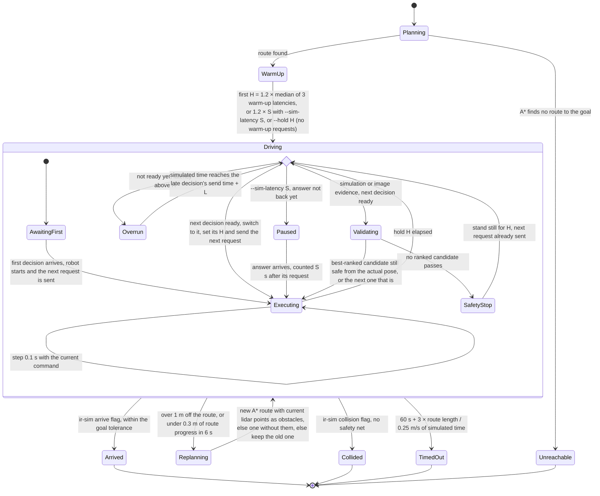

# Navigation episode

## Goal

One run from the start pose to the goal, ending in exactly one outcome that the report records.

## State

## Notes

- **WarmUp** runs after planning, so its requests carry a realistic map with the route drawn in.
- **Hold:** each command's H = 1.2 × max(its latency, median of the last 5), rounded up to
  0.1 s (see features/rizzo-decision.md).
- **AwaitingFirst:** the robot stands still while the first request runs.
- **Overrun:** the robot keeps the current command until the late decision arrives. It never
  changes direction without a decision from the model.
- **Paused** (fake timing, features/rizzo-decision.md): simulated time stops while the model
  thinks, so a slow model costs wall-clock time only.
- **Validating / SafetyStop** exist only with `--evidence simulation` and `image`: their
  commands are revalidated before execution, in order of probability, and a safety stop
  replaces them when none passes (features/simulation-decision.md). `grid` and `text` keep no
  safety net.
- The arrive, collision and time-limit exits are checked after every 0.1 s step.
- A replanned route is drawn into the next costmap captured at a command switch.
- The time limit scales with the route: a 20 m route gets 300 s of simulated time. With
  1.6–1.9 s holds and 1.3–1.6 s per request, that is at most about 4–5 minutes of wall-clock
  time.
- Report per episode: evidence mode, `--sim-latency`, served model, outcome, initial and
  median hold, warm-up latencies, time limit, simulated time, distance traveled, route length,
  straight-line distance, path efficiency, minimum lidar clearance, decisions, overruns,
  safety stops, validation fallbacks, replans, decider latency p50/p95, input tokens p50,
  histogram of executed commands, trajectory.
- `bench` runs every scenario × decider × seed, Rizzo first. The heuristic then gets a
  simulated latency equal to Rizzo's median, so both see the same holds. It prints success
  rate, collisions, time-outs, mean time, mean path efficiency, latency, overruns and safety
  stops per scenario × decider × evidence.

## Open Questions

- none
