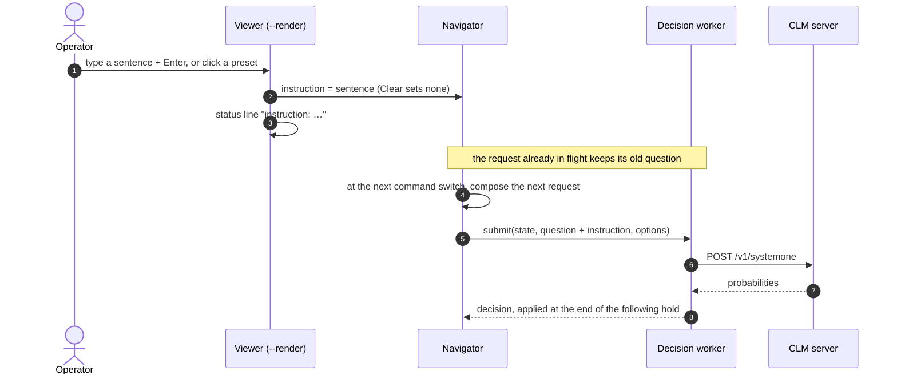

# Operator instruction

## Goal

Let the person watching a run steer CLM while it drives. A sentence typed in the viewer, or
picked from a preset, is added to every new request's question until it is changed or
cleared. The evidence and the options stay exactly the same; only the words of the question
change.

The instruction box and the preset buttons sit in a strip at the top left, above the
simulation view, which shrinks slightly to make room.

## Interaction



## Where the words go

The instruction is appended to the question's `instructions`, never to the `state`. CLM's
state head reads the state with the question appended after a blank line, so the instruction
ends up last in the text it embeds, the layout its heads were trained on. Every option is
scored against that one vector, so the instruction can only shift which option texts match
best.

```
Which command should the robot hold for the next 2.2 s? Follow this operator instruction, even
where it conflicts with the rule or preferences given: Stay as far from obstacles as you can,
even if it costs some progress.
```

The same suffix is used with `grid`, `text`, `simulation` and `image` evidence.

## Presets

| Button | Sentence |
| --- | --- |
| Keep clear | Stay as far from obstacles as you can, even if it costs some progress. |
| No reverse | Do not drive backward unless no forward command makes progress. |
| Hurry | Make the most progress along the route; clearance matters only when progress is equal. |
| Prefer left | When commands make similar progress, prefer the ones that curve left. |
| Prefer right | When commands make similar progress, prefer the ones that curve right. |
| Clear | (removes the instruction) |

## Notes

- **When it takes effect.** A request for the next decision is always in flight, so a new
  instruction first shapes the request after it. It reaches the robot between one and two
  holds later: two holds of simulated time in real time, one to two model answers of
  wall-clock time with `--sim-latency`.
- **Only what the evidence can support.** CLM can only weigh instructions about what the
  options describe: progress, distance off the route, goal distance, closest obstacle, and
  the motion words (forward, backward, left, right). "Keep obstacles on your right" can't be
  judged: no option says on which side an obstacle is.
- **ir-sim's keys are disconnected in the viewer.** ir-sim listens to the window's keys even
  in auto mode (space pauses, r resets, l reloads, x switches to keyboard control, Esc quits),
  so typing a sentence would trigger them. Close the window to stop a run.
- `--instruction "…"` sets the starting instruction, also for headless runs and `bench`. The
  trace records it per decision as `operator_instruction`, and the full question as
  `instructions`.
- The heuristic decider ignores instructions; the viewer says so in its status line.

## Open Questions

- none
