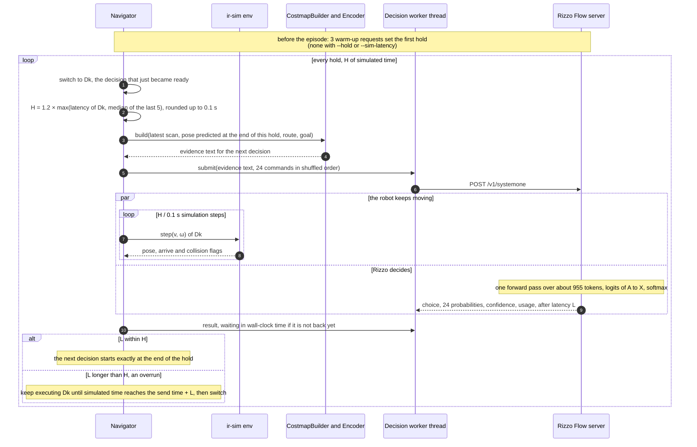
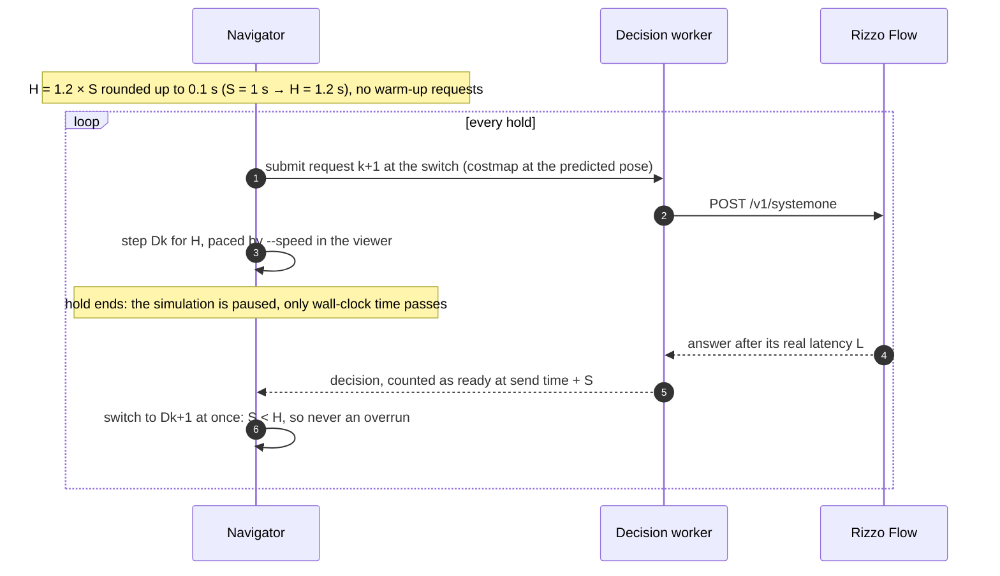

# Rizzo decision

## Goal

Rizzo Flow decides while the robot moves. Each command is held for a time H a little longer
than the model's latency: H = 1.2 × latency, 1.6–1.9 s on the M5. The next decision is
computed during that hold, so it is ready when the hold ends. H follows the latency the model
actually shows, so it stretches when the Mac slows down. The robot changes direction only
when a new decision has arrived. With `grid` and `text` evidence there is no safety net;
`simulation` and `image` revalidate the choice at the hold end
(features/simulation-decision.md).

## Timeline (example: latency 1.35 s, so H = 1.7 s)

```
simulated time (s)  0.0      1.4                 3.1                 4.8
                     │        │                   │                   │
robot command        │ still  │ D0                │ D1                │ D2  …
                     │        │                   │                   │
Rizzo request        │ R0 ──► │ R1 ────────►      │ R2 ────────►      │ R3  …
                     │ C0     │ C1       ready    │ C2       ready    │ C3
                     │        │          2.75     │          4.45     │
```

- **Ck**: the costmap captured when request Rk is sent. It is drawn around the pose the robot
  will have when Dk starts (see features/local-costmap.md).
- **Rk → Dk**: Rizzo's answer arrives after its measured latency, and is applied at the first
  0.1 s step after the previous hold ends.
- D1 is ready at 2.75 s and waits 0.35 s for D0's hold to end. When it starts at 3.1 s, its
  lidar data is H = 1.7 s old.
- At the start the robot stands still until D0 arrives.

## Interaction



## How latency maps to simulated time

- Every request's wall-clock latency L is measured, and its answer takes effect at
  send time + L in **simulated** time, rounded up to the next 0.1 s step. The robot therefore
  behaves exactly as if the simulator ran in real time.
- The simulator itself may run faster (headless) or slower (rendering) than the wall clock;
  that does not change the robot's behavior.
- **Wall-clock cost:** each hold takes about max(L, time to step H / 0.1 s times). Headless on
  the M5 that is about 1.35 s per 1.7 s of simulated time. A 20 m route at 0.25 m/s
  (at least 80 s, about 47 decisions) takes a little over one minute.

## Fake timing (`--sim-latency S`)

Real-time replay only works while the model answers in a couple of seconds. Qwen3-VL on the M5
takes 6–13 s, which would mean holds of 8–15 s, farther than the costmap reaches. With
`--sim-latency S`, every answer counts as S seconds of simulated time, whatever it took in
wall-clock time, and the simulation stops at the command switch until it arrives.



- The trace keeps the measured latency (`latency_s`); the report adds `sim_latency_s`.
- Safety stops still count 0 s. The heuristic in `bench` gets the same S.
- The viewer keeps refreshing during the pause and shows how long the model has been
  thinking; the robot does not move.

## Request sent to Rizzo (abridged, `--evidence grid`)

With `--evidence text`, `state` and `instructions` are the coordinate description of
features/text-evidence.md; the 24 criteria are unchanged.

```json
{
  "model": "rizzo-latest",
  "state": "Local costmap around a differential-drive robot. … * planned route to the goal, G goal.\n\n.....*..?????????????\n…",
  "questions": {
    "command": {
      "type": "choice",
      "instructions": "Choose the motion command the robot will hold for the next 1.7 s. Every move is at 0.25 m/s and rotations turn 45 degrees per second. Follow the planned route (*) toward the goal (G). Never drive into obstacle (#) or too-close (x) cells; avoid near-obstacle (+) and unknown (?) cells when you can.",
      "criteria": {
        "FL30": "Forward, curving left 15 degrees per second.",
        "L": "Full left: rotate in place to the left.",
        "…": "24 entries in total, shuffled at every decision"
      }
    }
  }
}
```

## Response shape (numbers are placeholders, not measurements)

```json
{
  "model": "rizzo-spark-x2.5-4b-q8_0",
  "answers": {
    "command": {
      "type": "choice",
      "choice": "FL30",
      "probabilities": {"FL30": 0.61, "FL45": 0.22, "…": "24 entries summing to 1"},
      "confidence": 0.59
    }
  },
  "usage": {"input_tokens": 955, "output_tokens": 0}
}
```

## Measured speed on this Mac (2026-09-24)

Apple M5 (Metal) · llama.cpp b11081 · Spark-X2.5-4B Q8_0 · the real request shape with the
example map from features/local-costmap.md · warm server, 8 requests per row, one question
per request.

| Maps | Option texts | Input tokens | Latency p50 | min – max |
| ---: | --- | ---: | ---: | ---: |
| 1 | long | 1,214 | 1.50 s | 1.50 – 1.51 s |
| 5 | long | 1,795 | 2.29 s | 2.28 – 2.30 s |
| 10 | long | 2,483 | 3.67 s | 3.44 – 3.92 s |
| **1** | **compact (adopted)** | **955** | **1.35 s** | **1.28 – 1.38 s** |
| 10 | compact | 2,224 | 3.07 s | 3.03 – 3.13 s |

- **Adopted: one map, compact texts.** 1.35 s p50. With H = 1.2 × 1.35 s → 1.7 s, the
  slowest request measured (1.38 s) still leaves 0.3 s of margin.
- Each 21 × 21 map costs about 141 tokens. With one map, most of the 955 tokens are the
  question: the 24 option texts, the instructions and Rizzo's own system prompt.
- Rizzo's README reports about 50 ms per decision on an RTX 5060 Ti, but for short requests
  (its ticket example is 291 tokens in total). Ours is 955 tokens, so those numbers don't
  transfer.
- Faster options, not yet tried: shorter option texts; the 1.7B model (about 2× faster by
  Rizzo's figures, much less accurate); a bigger GPU. Lower latency also shortens H.

## First benchmark (2026-09-24)

`jevnav bench --seeds 0 1 2`, adaptive hold, M5 under sustained load (Rizzo latency p50
1.7–2.3 s, so holds of 2.0–2.8 s). The heuristic ran on the same costmaps and commands with
a simulated latency equal to Rizzo's median, so both saw the same data age and holds.

| Scenario | Rizzo 4B Q8_0 | Heuristic baseline |
| --- | --- | --- |
| open | 0/3 arrived, 3 collisions | **3/3** arrived, path efficiency 1.00 |
| slalom | 0/3 arrived, 3 collisions (within about 4 m) | **3/3** arrived, path efficiency 0.96 |
| crossing (3 moving obstacles) | 0/3 arrived, 3 collisions | 1/3 arrived, 2 hit by moving obstacles |

- Timing is sound: 0–2 overruns per Rizzo episode.
- Caveat found later: the first decision of every episode saw an empty map, because ir-sim
  had not yet computed a scan (see features/local-costmap.md). It could explain early
  collisions such as `open` seed 2 after 2 decisions.
- Every Rizzo collision came from its own choice, so the pipeline did not cause it. The traces
  show the inputs were correct (obstacle cells beside R, the route bending away). The model
  mostly picks F and near-F commands regardless of the map. This matches Rizzo's README:
  the 4B model "does not read a grid spatially" and plays Snake only with per-move sensor text.
- `crossing` is hard for the baseline too: a single snapshot shows no motion, and each
  command is held for more than 2 s.

## Notes

- **Selection:** Rizzo's choice, the argmax of its probabilities, with no sampling. With
  `grid` and `text` there is no safety check and a collision ends the episode; `simulation`
  and `image` walk the ranking at the hold end (features/simulation-decision.md).
- **Adaptive hold.** Each command's H is 1.2 × the larger of its own latency and the median
  of the last 5, rounded up to the 0.1 s step. The warm-up only sets the first H. Every H is
  recorded in the trace, with the number of overruns. `--hold-factor` changes the 1.2;
  `--hold` fixes H for experiments.
- **Why adaptive** (measured 2026-09-24): on this fanless Mac the latency drifts upward under
  sustained load. It was 1.26–1.35 s cold, 1.46–1.58 s after a few minutes, and about 2.2 s
  during a long benchmark. With a hold fixed from the warm-up, most decisions arrived late,
  the previous command ran on, and the robot was no longer where its costmap was centred.
- **Shuffling:** the 24 commands are shuffled with the episode seed at every decision, which
  maps them to different letters. Rizzo's README reports residual position bias; shuffling
  spreads it instead of favoring the same command every time.
- **Confidence** is Rizzo's Jev-compatible (n · p_max − 1)/(n − 1), with n the number of
  options offered (24 with `grid` and `text`). It describes
  the shape of the distribution and is uncalibrated: it is not the probability of being right.
- **HeuristicDecider (baseline):** same input (the same predicted-pose costmap) and the same
  24 commands. It simulates each command for H on the grid and never picks one that crosses
  `#` or `x` unless nothing else is left. It prefers the command that ends closest to the
  farthest visible route cell, measured along the visible `*` cells, with small penalties for
  ending off the route and for `+` and `?` cells. Its probabilities are a softmax of these
  scores at temperature 0.1. In `bench` it runs after Rizzo with a
  simulated latency equal to Rizzo's median, so both see the same data age and holds, and
  the comparison isolates decision quality.
- **Trace:** for every decision, `--trace` stores the send and apply times, the predicted
  pose, the evidence text, the full question (`instructions`), the shuffled option order, the
  probabilities, the choice and its probability, the confidence, the latency,
  `usage.input_tokens`, the hold, the overrun, the `ranking` and the `executed` command.
  `simulation` and `image` add `removed`, `fallbacks` and `option_texts`; `image` adds
  `image_png`; an operator
  instruction is stored as `operator_instruction`. Warm-up requests are not traced; the report
  keeps their latencies.
- A server error or timeout stops the episode with an error. It is never replaced silently by
  the baseline.

## Open Questions

- none
