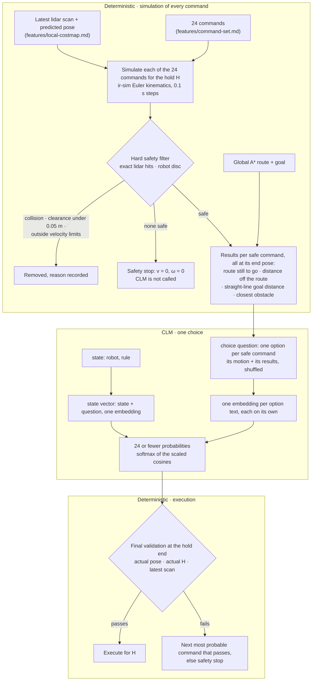

# Simulation decision (experiment 2, `--evidence simulation`)

## Goal

CLM decides with "Snake logic": the simulator computes what each of the 24 commands would
do; the model only chooses. Every command is simulated for the hold from the pose where
it would start. Commands that would collide are removed. For each safe one, CLM reads where
the command would leave the robot: how far it would still be from the goal, along the planned
route and in a straight line, how far off the route it would be, and how close the nearest
obstacle would be. Then it picks one command. `grid` and `text` stay unchanged for comparison.
`--evidence image` runs this same pipeline and adds the costmap as a picture; it is dormant
until a vision CLM exists (features/image-evidence.md).

## Flow



## Evidence (the `state` field)

```
Differential-drive robot of radius 0.2 m, at the pose where the next command starts. It moves
at 0.25 m/s or rotates in place at 45 degrees per second. The chosen command is held for 2.2 s.
Every command offered was simulated for the whole hold and is collision-free; commands that
would collide are not offered.
Rule: prefer the command that leaves the robot with the least distance still to go along the
planned route to the goal. Among commands that leave a similar distance to go, prefer the one
that ends closer to the route, then the one that ends farther from obstacles. The straight-line
distance to the goal only breaks the remaining ties.
Every distance in an option is measured where the robot is when the command ends. Closest
obstacle is the gap between the robot's edge and the nearest obstacle the lidar sees.
```

## Question (Jev `choice`)

Instructions: `Which command should the robot hold for the next 2.2 s?`

One option per safe command, shuffled with the episode seed at every decision (illustrative
numbers):

| Key | Description |
| --- | --- |
| `FL30` | Forward, curving left 15 degrees per second. After it: 8.05 m to go along the route, 0.12 m off the route, 7.20 m straight to the goal; closest obstacle 0.44 m. |
| `L` | Full left: rotate in place to the left. After it: 8.57 m to go along the route, 0.05 m off the route, 7.69 m straight to the goal; closest obstacle 0.62 m. |
| `B` | Full backward: straight back. After it: 9.12 m to go along the route, 0.05 m off the route, 8.24 m straight to the goal; no obstacle in lidar range. |

- **Why the results sit in the options.** In Snake the per-move sensors are in the state and
  the options only name the move, which works with 3 moves. Here there are up to 24, so each
  option carries its own results. For CLM this is also the only place they can go: it scores
  each option text against the state on its own, so an option is judged by what its own text
  says. It never reads two options side by side, so it cannot subtract one option's distance
  to go from another's; whether the embedding orders such numbers is what this mode tests.
- **Closest obstacle** is measured at the command's end pose: the distance from the robot's
  centre to the lidar hits and hit-joining segments, minus the robot radius. The safety filter
  computes it next to its own minimum over the whole command, which still decides what is
  offered, so it is at least 0.05 m for every offered command. With no lidar hit in range it
  reads "no obstacle in lidar range".
- **Route still to go:** the route's length minus the station of the command's end point.
  The end point is projected onto the route near the start's own projection, so a looping
  route can't jump ahead. It accounts for walls; the straight-line distance doesn't.
- **Off the route:** the distance from the command's end point to that projection. Route still
  to go gives credit for sideways moves; this number shows how far they leave the route.

## Hard safety (unchanged from the previous design)

| Check | Rule |
| --- | --- |
| Collision | robot disc (radius r) along the trajectory, every 0.1 s, touches a lidar hit or the segment joining two consecutive hits less than 2r apart |
| Clearance | minimum distance from the disc to those points and segments ≥ 0.05 m (`--clearance`) |
| Kinematics | v and ω within the robot's `vel_min` / `vel_max` |

- The filter uses the scan the evidence is built from. Final validation re-simulates the
  chosen command from the actual pose over the actual H, against the latest scan. It walks
  the model's probabilities in order and skips anything outside the offered set.
- A safety stop holds v = 0, ω = 0 for the current H. Its zero latency neither updates H nor
  enters the latency median.
- Unknown space is not a hard constraint: only observed obstacles are.

## Command line

```bash
uv run jevnav run slalom --render --evidence simulation
uv run jevnav run slalom --evidence simulation --trace runs/simulation.json
uv run jevnav run slalom --decider heuristic --evidence simulation   # baseline on the same safe set
```

The report adds `safety_stops` and `validation_fallbacks`. Each trace record adds `removed`
(the reason for each unsafe command), `fallbacks` (ranked commands skipped at validation) and
`option_texts` (every option exactly as CLM read it); `ranking` and `executed` show when
validation changed the choice.

## Notes

- **Rotations show the robot's current values.** Rotating in place changes none of the
  distances, so L and R report where the robot already is; moving away from an
  obstacle reports more clearance than they do. The state gives no "now" values, so the model
  judges progress only from the options' own numbers. Heading is not among the results (decided
  2026-09-24).
- **Behind the route's start**, a reverse shows the same route still to go as a rotation,
  because the projection stops at the route's first point. The distance off the route and
  the straight-line distance show the loss.
- **Replaces the geometry mode** (per-candidate trajectory polylines with `noul` judgments
  and a left/right heuristic) and its offline benchmark. Both were removed on 2026-09-24 before
  being evaluated. Their sources were archived only in a temporary session scratchpad and are
  no longer available; they never reached git.
- The heuristic baseline reads the same costmap and scores progress along the visible route
  with small penalties. On the same safe set, it and CLM should mostly agree when CLM
  follows the rule.

## Decisions (2026-09-24)

- Results per command: route still to go and straight-line goal distance, each with its
  change from now. No off-route distance or heading.
- Closest obstacle added to every option (2026-09-24, requested after the first runs), with a
  rule to prefer more clearance among commands with similar progress.
- Colliding commands are removed before the model, not labeled.
- The geometry mode is replaced; `grid` and `text` stay.
- No offline benchmark: the mode is evaluated with live runs.

## Decisions (2026-09-26)

- Every option reports only the values where its command ends: no change from now, and no
  "Now" line in the state.
- Closest obstacle is measured at the end pose, not as the minimum along the command. The
  minimum included the start pose, so no command could report more clearance than a rotation
  in place; with the instruction "stay far from obstacles" the model kept rotating.
- Distance off the route added to every option, ranked after progress and before clearance.
  This reverses 2026-09-24's "no off-route distance": route still to go alone did not show
  how far a command strays from the route. Progress stays first because a rotation in place
  on the route is 0.00 m off it.

## Open Questions

- none
