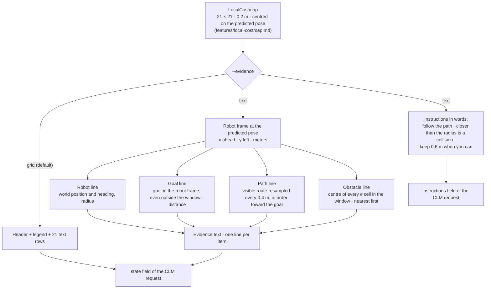

# Text evidence (experiment 1)

## Goal

Describe the same local costmap to CLM in words and coordinates instead of an ASCII grid:
the robot's pose and heading, the goal, the planned path and the obstacle points in the
window, all relative to the robot. It tests whether the model decides better from coordinates than
from a grid. Selected with `--evidence text`; the grid stays
the default.

## Flow



## Robot frame

```
            +x  (ahead: F)
             ▲
             │   (1.2, 0.4)
   +y ◄──────R      y > 0: left   (L, FL…)
  (left)     │      y < 0: right  (R, FR…)
             │      x < 0: behind (B…)
```

The frame is the robot at the predicted pose, the same pose the grid is centred on. The
command texts use the same words (forward, left, right, backward).

## Evidence text (the `state` field)

```
A differential-drive robot of radius 0.2 m, described where it will be when the chosen command starts.
Robot: at (3.2, 1.5) in the world, heading 45 degrees.
Coordinates below are in meters relative to the robot: x is ahead (negative: behind), y is to the left (negative: right).
Goal: (4.1, 2.3), 4.7 m away.
Planned path to the goal, a point every 0.4 m, nearest first: (0.0, 0.1) (0.4, 0.2) (0.8, 0.4) (1.1, 0.7) (1.4, 1.0) (1.6, 1.3)
Obstacles seen by the lidar within 2 m ahead, behind or to either side, nearest first: (0.6, -0.4) (0.6, -0.2) (0.8, -0.4) …
```

- Every coordinate is rounded to 0.1 m. Obstacle points are cell centres, so they sit on a
  0.2 m lattice.
- Empty lines say `none`: `Planned path …: none in view` when the robot is over 2 m off the
  route, `Obstacles …: none` when the lidar sees nothing in the window.

## Instructions (text mode)

```
Choose the motion command the robot will hold for the next 1.7 s. Every move is at 0.25 m/s
and rotations turn 45 degrees per second. Follow the planned path toward the goal. An obstacle
point closer than 0.2 m to the robot centre is a collision; keep at least 0.6 m from every
obstacle point when you can.
```

## Notes

- **Same information, minus unknown space.** The obstacle points are the grid's `#` cells,
  the path is the grid's `*` cells resampled every 0.4 m, and 0.2 m and 0.6 m are the
  grid's `x` and `+` thresholds. What is dropped is the free-versus-unknown distinction
  (`.` and `?`). What is added is the goal position when the goal is outside the window.
- **Token cost grows with the obstacles** (measured 2026-09-24, 12 maps from the three
  scenarios, warm server): about 9 tokens per obstacle point, instead of a fixed 141 tokens
  for the grid. Scenarios show 0–43 points per map, 23 at the median in `open` and `slalom`.
  With CLM only the state is embedded at every decision, so crowded maps cost a longer
  encoder pass and, through the adaptive hold, a longer hold.
- The HeuristicDecider ignores the evidence text (it reads the LocalCostmap), so its results
  are the same with `grid` and `text`. With `simulation` or `image` it chooses among the safe
  commands only, and its choice is revalidated.
- Reports and `bench` tables record the evidence mode, so grid and text runs can be compared.

## Results

- None with CLM yet. Results with the previous model server (2026-09-24) are in git history
  before 2026-10-05.

## Open Questions

- none
