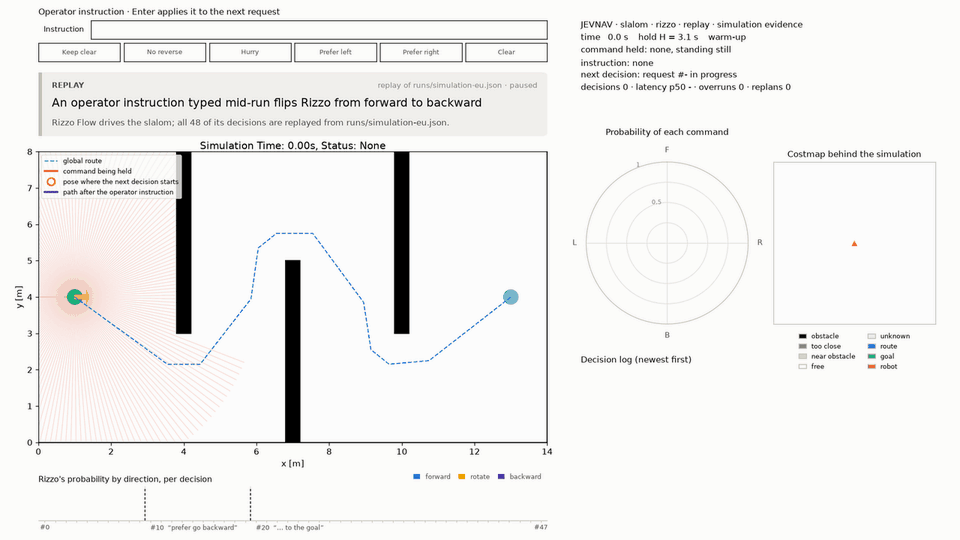

# JEVNAV

**A small language model drives a robot, one probability distribution at a time.**

JEVNAV lets [Rizzo Flow](https://github.com/Rizzo-AI-Academy/rizzo-flow), a local, Jev-style
"System One" model, drive a differential-drive robot to its goal in the
[ir-sim](https://github.com/hanruihua/ir-sim) 2D simulator. At every decision the model reads
what the lidar sees and returns a probability for each of 24 fixed motion commands, from a
single forward pass: it never generates text.



*Slalom scenario, simulation evidence, replayed at 8× speed. After ten decisions the operator
types "prefer go backward", later "prefer go backward to the goal". The evidence and the
options stay the same; only the words of the question change, and Rizzo's driving follows
them: backward commands go from 0 of the first 10 decisions to 32 of the next 38.*

## How it works

1. **Plan once.** A clearance-aware A* on the scenario's static map gives the global route.
2. **Look.** Before each command starts, the latest lidar scan (180 beams, 5 m) becomes a
   21 × 21 local costmap with 0.2 m cells. It is centred on the pose the robot will have when
   the command starts, with the route and the goal drawn in.
3. **Ask.** JEVNAV sends the evidence and the 24 commands, shuffled and lettered A–X, to
   Rizzo Flow's Jev-compatible `POST /v1/systemone`. Rizzo scores the answer letters in one
   forward pass and returns their softmax.
4. **Act.** The chosen command is held for H seconds, adaptive at 1.2 × the model's measured
   latency, while the next decision is already being computed in the background.
5. **Recover.** The route is replanned when the robot drifts more than 1 m from it or stops
   making progress.

The 24 commands are travel directions 15° apart: straight ahead and back at 0.25 m/s, rotate
in place at 45°/s, and forward or backward arcs turning at 7.5 to 37.5°/s
([full table](.specs/features/command-set.md)).

### What the model reads: `--evidence`

| Mode | Rizzo reads | Safety net |
| --- | --- | --- |
| `grid` (default) | the costmap as an ASCII grid with a legend | none, on purpose: the most probable command is executed as is, and a collision ends the episode |
| `text` | the same costmap as coordinates in the robot frame: pose, goal, route and obstacle points | none |
| `simulation` | "Snake logic": every command is simulated for the hold, and unsafe ones (collision, clearance under 0.05 m, velocity limits) are removed. Each remaining option says where it would leave the robot: route still to go, distance off the route, straight-line distance to the goal, closest obstacle | the ranking is rechecked from the actual pose at the end of the hold; the next safe command, or a stop, replaces an unsafe one |
| `image` | `simulation` plus the costmap as a 1344 × 1344 PNG, for a vision-language model (Qwen3-VL-4B-Instruct) | as `simulation` |

A classical **heuristic decider** (`--decider heuristic`) reads the same costmap and serves as
the baseline. It needs no model.

With `--render`, an **operator instruction** box and presets (keep clear, no reverse, hurry,
prefer left, prefer right) add a sentence to every new question while the robot drives;
`--instruction "…"` does the same from the command line.

## Requirements

- Python 3.11 or later and [uv](https://docs.astral.sh/uv/).
- For the model: a Rizzo Flow server and about 6 GB of GPU memory. Rizzo Flow downloads a
  prebuilt llama.cpp for your machine; see its README for the supported hardware. JEVNAV was
  developed and measured on an Apple M5 Mac (Metal).
- The heuristic decider and the tests need neither.

## Install

```bash
git clone https://github.com/RoboticsNetworkTrieste/JevNav.git
cd JevNav

git clone https://github.com/hanruihua/ir-sim.git external/ir-sim
git -C external/ir-sim checkout dd7f1e5

uv sync
uv run pytest -q
```

ir-sim is installed in editable mode from `external/ir-sim`; `dd7f1e5` is the tested commit.

Rizzo Flow runs as a separate server with its own environment. The `vlm-costmap-image` branch
of the fork below adds the vision backend that `--evidence image` needs; upstream Rizzo Flow is
enough for the other modes.

```bash
git clone -b vlm-costmap-image https://github.com/RoboticsNetworkTrieste/rizzo-flow.git external/rizzo-flow
cd external/rizzo-flow
uv sync --locked
uv run rizzo download       # llama.cpp runtime + Spark-X2.5-4B Q8_0, about 4.4 GB
uv run rizzo serve          # http://127.0.0.1:8017
```

For `--evidence image`, serve Qwen3-VL-4B-Instruct instead (Q8_0 4.3 GB + projector 0.8 GB):

```bash
uv run rizzo download --vision --only weights
uv run rizzo serve --vision
```

Run one model server at a time.

## Run

```bash
uv run jevnav scenarios                                   # open, slalom, crossing
uv run jevnav run slalom --decider heuristic --render     # no model needed
uv run jevnav check                                       # is Rizzo Flow answering?
uv run jevnav run open --render                           # Rizzo drives, grid evidence
uv run jevnav run open --render --evidence text
uv run jevnav run slalom --render --evidence simulation
uv run jevnav run slalom --render --evidence simulation --instruction "Stay far from obstacles."
uv run jevnav run slalom --render --evidence image --sim-latency 1
uv run jevnav bench --seeds 0 1 2 --output runs/bench.json
```

A scenario is a bundled name or a path to an ir-sim YAML file. `bench` runs every scenario ×
decider × seed; the heuristic gets Rizzo's median latency, so both see the same holds.

| Option | Effect |
| --- | --- |
| `--render`, `--speed 2` | live window: the ir-sim view plus a sidebar with a probability compass, the costmap the model saw and the decision log; playback speed |
| `--save-gif PATH`, `--save-frame PATH` | an animated GIF of the run, or its last frame, headless |
| `--report PATH` | the episode report: outcome, time, path efficiency, clearance, latency, overruns |
| `--trace PATH` | every decision: evidence, option order, the 24 probabilities, the image |
| `--hold H` | a fixed hold instead of 1.2 × latency |
| `--sim-latency S` | fake timing for slow models: every answer counts as S simulated seconds, and the simulation pauses while the model thinks |
| `--clearance M` | `simulation` and `image`: the minimum clearance for a command to be offered |
| `--jev-url`, `--model`, `--api-key-env` | any Jev-compatible `/v1/systemone` endpoint |

On the Apple M5 with a warm server, a `grid` decision with Spark-X2.5-4B takes about 1.3 s and
a `simulation` decision 2–3 s. An `image` decision with Qwen3-VL-4B takes about 10 s, which is
what `--sim-latency` is for.

## Limitations

- Rizzo sees one snapshot per decision, never a history, so moving obstacles look static.
- `grid` and `text` have no safety net by design: they measure what the model does alone.
- Rizzo Flow's README reports that its 4B model plays Snake well from per-move sensor text but
  poorly from an ASCII grid alone. JEVNAV asks the same question on navigation, against the
  heuristic baseline.
- The accuracy of the vision mode has not been measured yet.
- Only macOS on Apple Silicon has been tested.

## Design

The design lives in [`.specs/`](.specs/architecture.md) as a shared visual model:
[`architecture.md`](.specs/architecture.md) plus one file per feature, each built around one
primary view.

| Feature | View |
| --- | --- |
| [Navigation episode](.specs/features/navigation-episode.md) | State |
| [Global route](.specs/features/global-route.md) | Flow |
| [Local costmap](.specs/features/local-costmap.md) | Flow |
| [Command set](.specs/features/command-set.md) | Direction chart + table, generated from `commands.py` |
| [Rizzo decision](.specs/features/rizzo-decision.md) | Interaction |
| [Text evidence](.specs/features/text-evidence.md) | Flow |
| [Simulation decision](.specs/features/simulation-decision.md) | Flow |
| [Image evidence](.specs/features/image-evidence.md) | Interaction |
| [Operator instruction](.specs/features/operator-instruction.md) | Interaction |

Each change starts from the smallest affected view, and the view is re-synced with what was
built. The source code has no comments or docstrings on purpose: intent lives in names,
types, tests and the specs.

```text
src/jevnav/            navigator, costmap, route planner, safety, simulation, prompt,
                       deciders, visualizer, CLI
src/jevnav/scenarios/  open, slalom, crossing (ir-sim YAML)
tests/                 unit tests with stub deciders, no model needed
.specs/                the design
docs/                  README media
external/              ir-sim and Rizzo Flow checkouts, not tracked
```

## Development

```bash
uv run pytest -q
uv run ruff format src tests && uv run ruff check src tests
```

## Acknowledgements

- [Rizzo Flow](https://github.com/Rizzo-AI-Academy/rizzo-flow) by Simone Rizzo — Rizzo AI
  Academy (Apache-2.0), the model server.
- [ir-sim](https://github.com/hanruihua/ir-sim) by Ruihua Han (MIT), the simulator.
- Spark-X2.5-4B by XHToken, Qwen3-VL-4B-Instruct by the Qwen team, and
  [llama.cpp](https://github.com/ggml-org/llama.cpp), which Rizzo Flow downloads and runs.

"Jev" and "TypeSafe" are names of TypeSafe's products; JEVNAV is independent and not
affiliated.

## License

Apache-2.0: see [LICENSE](LICENSE) and [NOTICE](NOTICE).
